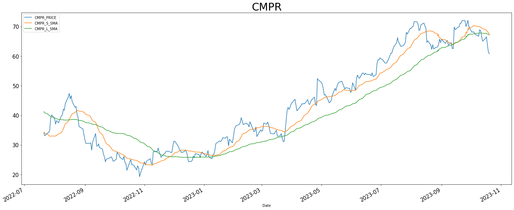

# stock-app
 
This project involves finding the all the currently available stocks in Yahoo Finance, retrieving historical data and using quantitative techniques to visualize buy signals for long-only trading strategies.

Please note, none of this is investment advice. This is purely a personal project to learn more about quantitative finance. 
### Mean Reversion 

The first quantitative technique that will be explored is Mean Reversion.

Code and visuals used were inspired by the following article: https://medium.com/auquan/mean-reversion-simple-trading-strategies-part-1-a18a87c1196a 

The default parameters for the long-term moving average are based off 60 works days (i.e. 3 months) and a short term of 20 days. This can be changed when initializing the MeanReversion class.

A buy signal is based on the 20d moving average falling below the 60d moving average. 

As a supplement the mean reversion strategy, momentum indicators and the stock's volatility have been accounted for when choosing which stocks should be invested in over a 20-day trading window.

The stocks are ranked based on the following criteria:
1. How tight the spread is between the 20-day and the 60-day moving average (this spread is based on the 20d moving average > 60d moving average)
2. How quickly the stocks price has declined in the past 20 days (i.e. the momentum indicator)
3. The price volatility of the stock over the past 400 days

The ranks are added up into an overall ranking and the top 20 are chosen. Qualitative research should then be taken to decide whether the stock.

The notebook for showcasing the stock can be found here: [Mean Reversion Notebook] (mean_reversion_top_stocks.ipynb)

Examples can be seen below:

